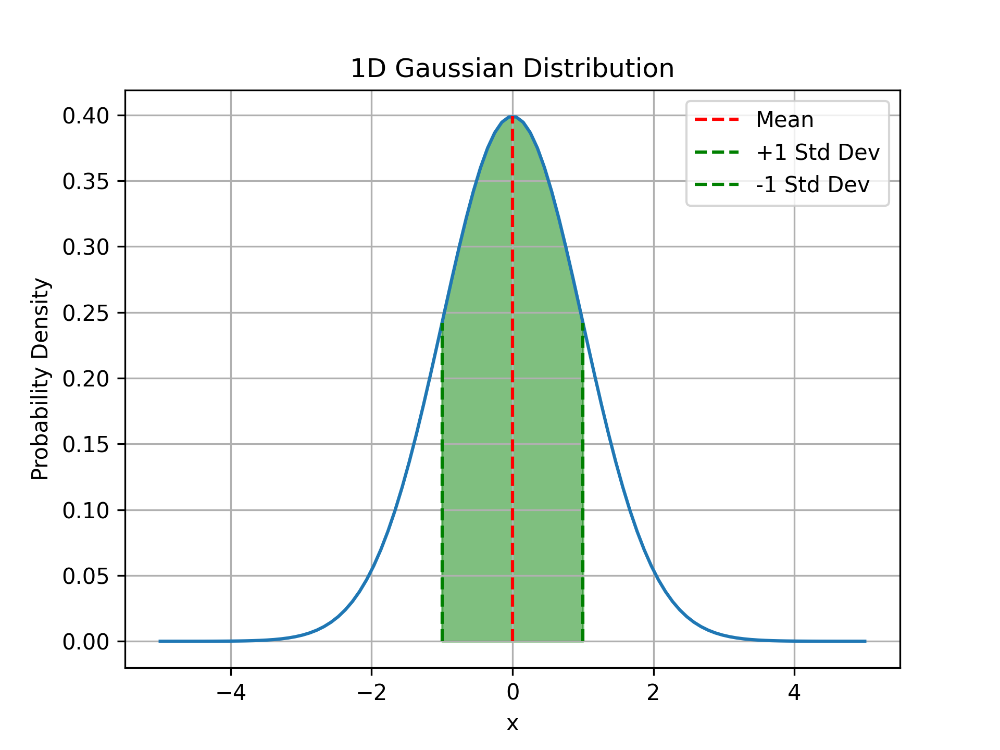
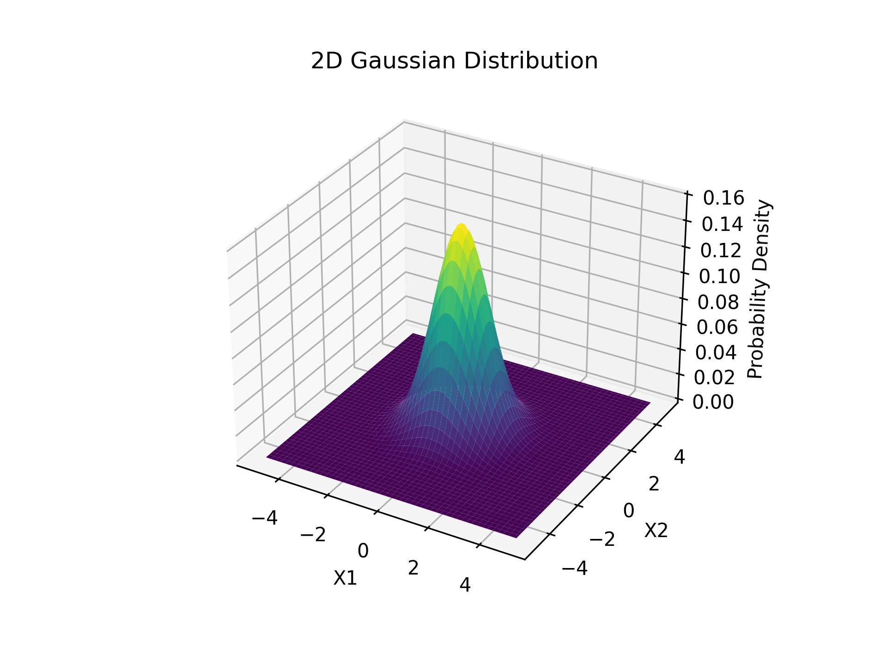
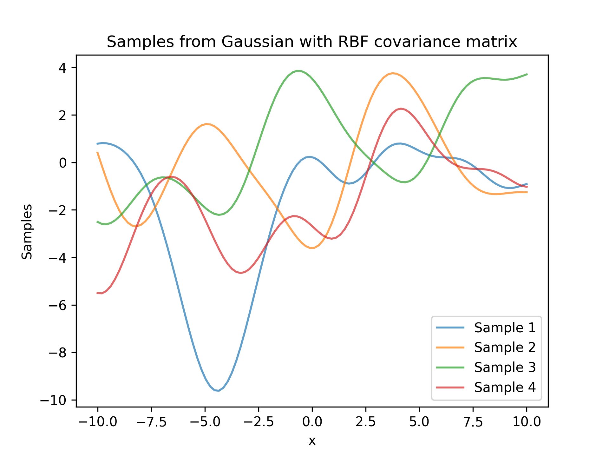
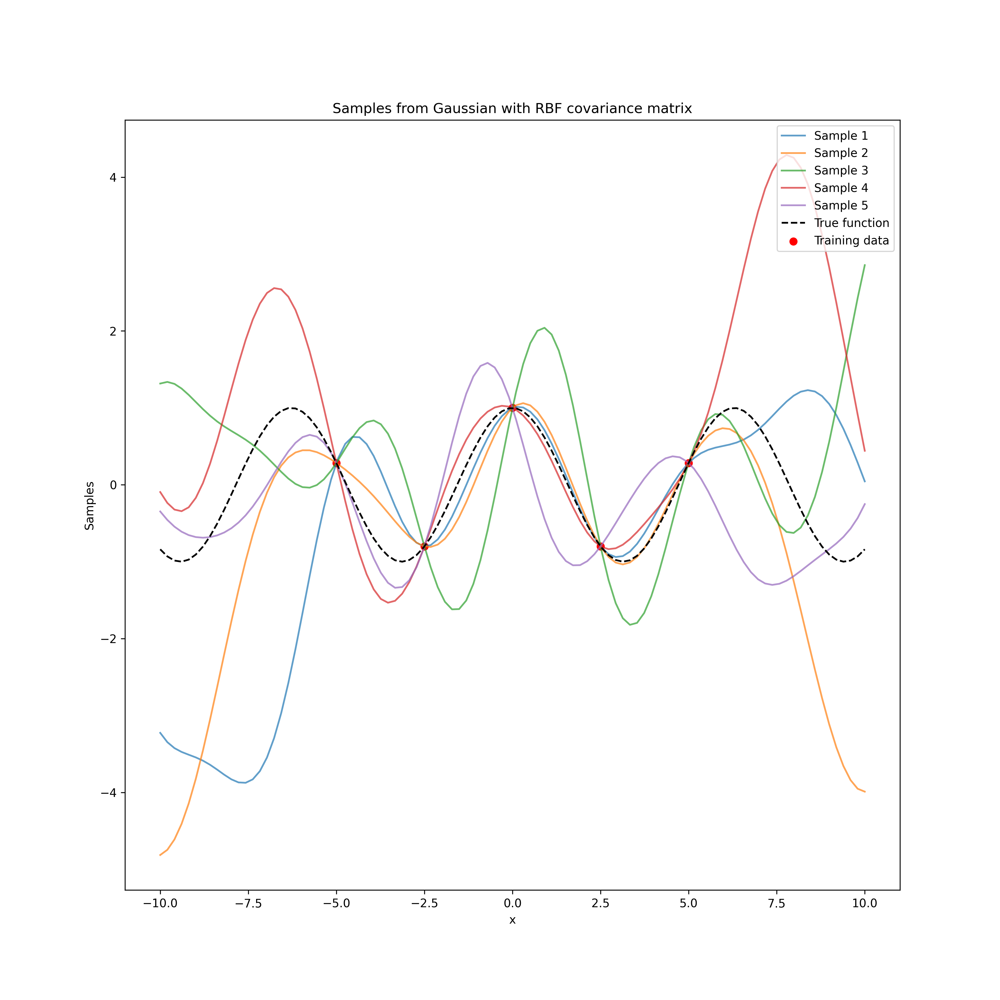

# Gaussian processes

A gaussian process is a method of approximating data using Bayesian statistics, given some data $X$ we want to be able to approximate the function that produced it, the idea of the gaussian process is that we can predict the shape of the underlying distribution.

The fact that it is bayesian means that as we add new datapoints the fitting to the function improves.

## Normal distribution

The normal (gaussian) distribution takes a mean $\mu$ and standard deviation $\sigma$, the one dimensional pdf of the function has the form:

$$p_X(x;\mu,\sigma) = \frac{1}{\sqrt{2\pi}\sigma}e^{-\frac{(x-\mu)^2}{2\sigma^2}}$$

If some data $X$ is distributed normally we say that $X$ ~ $N(\mu, \sigma^2)$. The below image shows a normal distribution with some interesting parts indicated.

 

In higher dimensions we can define gaussians too, in 3d it looks like a bell, and as the dimensions increase it becomes harder to visualise, A 2 dimensional gaussian can be defined by two quantities:

1. A vector of means, $\vec\mu$ which contains the mean for each dimension of the normal distribution
2. A covariance matrix $\Sigma$ where the diagonal elements $\Sigma_{ii}$ are the variances for each dimension and the off diagonal elements are $\Sigma_{ij}$ which define the correlation between the respective dimensions of data. The ij element of the covariance matrix is $\Sigma_{ij} = \mathbb{E}[(X-\mu_i)(Y-\mu_j)]$

The correlations between the variables define the shape of the normal distribution. See the plot below.

## Marginalisaiton and conditioning of the Gaussian

Suppose that we have a normal distribution over two random vectors $X$ and $Y$, $P(X,Y)$ then their joint distribution is defined as:

$$
P_{X,Y} \sim N(\vec\mu, \Sigma) = N(
    \begin{pmatrix}
    \mu_X \\
    \mu_Y
    \end{pmatrix},
    \begin{pmatrix}
    \Sigma_{XX} \ \Sigma_{XY} \\
    \Sigma_{YX} \ \Sigma_{YY}
    \end{pmatrix}
)
$$

**Where we're using block matrix notation here, so** $\Sigma_{XY} \in \mathbb{R}^{|X| \times |Y|}$.

These operations are defined as follows:

1. **Marginalisation**: We can find the marginalised distributions of $X$ and $Y$ as $X \sim N(\mu_X, \Sigma_{XX})$ and $Y \sim N(\mu_Y, \Sigma_{YY})$.
2. **Conditioning**: The probability of an event given some prior knowledge can be calculated as $X|Y \sim N(\mu_X + \Sigma_{XY}\Sigma_{XX}^{-1}(Y-\mu_Y), \Sigma_{XX} - \Sigma_{XY}\Sigma_{YY}^{-1}\Sigma_{YX})$

Gaussian distributions are closed under both of these operations, meaning that after we apply these operations the final distribution is still gaussian.

## Why use gaussians?

Suppose that we have some input training data $Y$, we can treat each element of this vector as a normally distributed variable. Let $X$ denote the testing data that will be used to assess the gaussian. The key idea of the gaussian process is to model the underlying distribution of $X$ together with $Y$ as a multivariate normal distribution.

### Covariance functions aka Kernels

When setting up a gaussian process (a type of stochastic process) we need to have an initial value for the mean and covariance matrix. Usually we can set the mean to be 0. We define the covariance using a covariance function, $k$, as this will define the behaviour of the function that is being fitted.

A common kernel function that is used is the RBF Kernel defined as follows:

$$
k(t,t') = \sigma^2e^{-\frac{|t-t'|^2}{2l^2}}
$$

So we can calculate the $i,j$ component of the covariance matrix $\Sigma_{ij} = k(x_i,x_j)$.

We can then take a vector of points $X$ with some dimensionality, $N$, and calculate the covariance matrix by looping over these points pairwise. This essentially allows us to shape the gaussian distribution with a certain kernel. We then take the output of the distribution we can treat each entry as a function value, see the figure below.

Given a set of values we can then generate random functions from these covariance matrices.

### Posterior distribution

Bringing this task back to regression, we need to find a way to fit a gaussian process to a function. We need to use the ideas from bayesian inference, we can use the training data to create a posterior distribution from a prior distribution aka $P_{X|Y}$.

First we need to form the joint distributions between the test points ($X$) and the training points ($Y$), $P_{X,Y}$. Then from this joint distribution we can use bayes' theorem to find the conditional distribution of the data aka the posterior distribution, so then $X|Y \sim N(\vec\mu',\Sigma')$. When we condition on the training points, $Y$, we are left with a gaussian with a dimension of $|X|$.

The conditional distribution here is defined with $X$ and $Y$ where we presume that the mean is $\vec\mu = \vec0$ and the covariance matrix $\Sigma$, of the joint distribution of $X,Y$, suppose that $|X| = N$ and $|Y| = M$ so the covariance matrix is $\Sigma \in \mathbb{R}^{M + N \times M + N}$.

$$
\Sigma = \begin{pmatrix}
    \sigma_{1,1} \ \dots \sigma_{1, N} \dots \ \sigma_{1, M + N} \\
    \vdots \\
    \sigma_{N, 1} \dots \ \sigma_{N,N} \ \dots\sigma_{N, M+N}\\
    \vdots \\
    \sigma_{M+N,1} \ \dots \ \sigma_{M+N,N} \dots \ \sigma_{M+N, M + N} \\
\end{pmatrix}
$$

Or alternatively, using the notation that $k(X,Y) \in \mathbb{R}^{|X| \times |Y|}$, we have that:

$$
\mathbb{\Sigma} = \begin{pmatrix}
    k(X,X) \ k(X,Y) \\
    k(Y,X) \ k(Y,Y)
\end{pmatrix}
$$

Our aim when approximating functions is given some training data $Y$ can we predict the function values for some tesing data $X$, in other words if we have the trianing pairs $(X_1,Y_1)$ and then the testing data $X_2$, we want to predict $Y_2$. Then we have that:

$$
p(Y_2|Y_1, X_1, X_2) \sim N(\Sigma_{X_2X_1}\Sigma_{X_1X_1}^{-1}Y_1, \Sigma_{X_2X_2} - \Sigma_{X_2X_1}\Sigma_{X_1X_1}^{-1}\Sigma_{X_1,X_2})
$$

Then samples taken from this are guaranteed to go through the points defined by $(X_1,Y_1)$, see the figure below:

