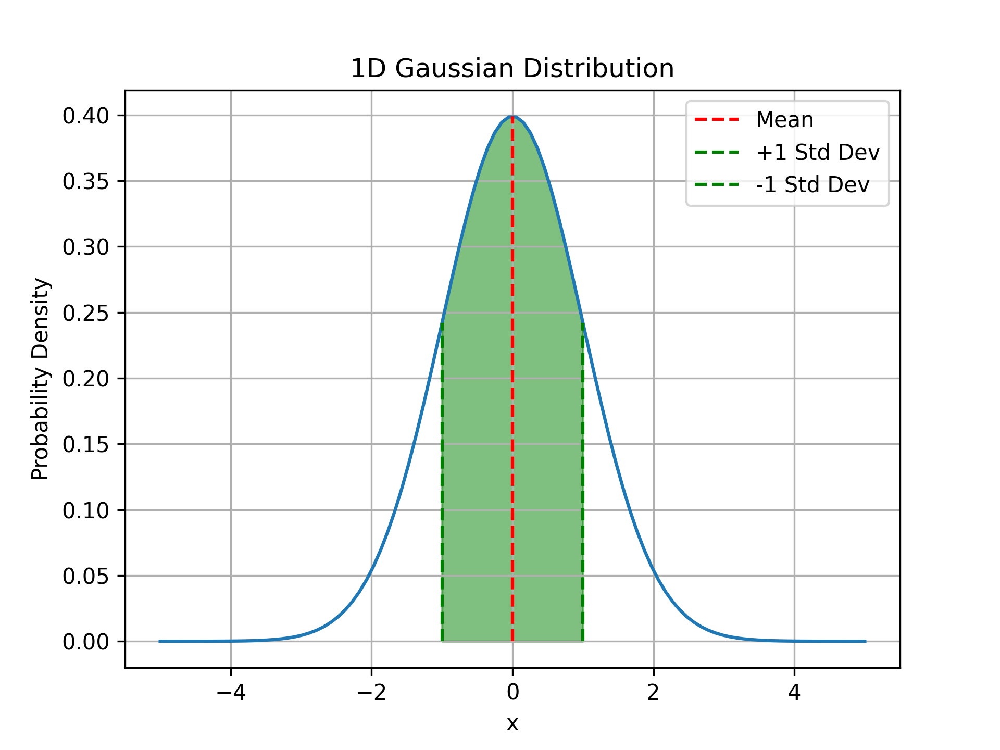
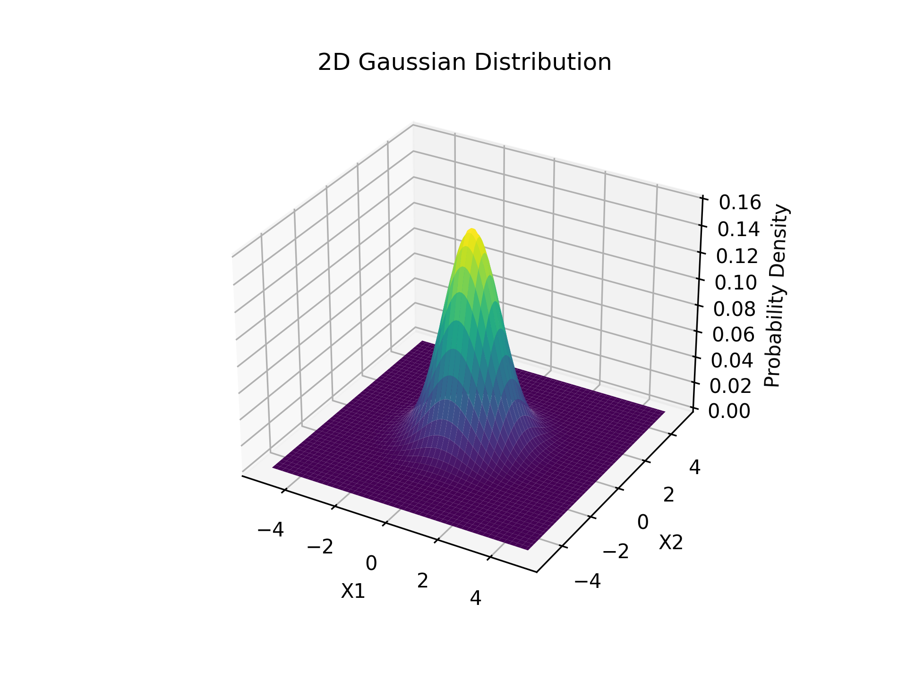
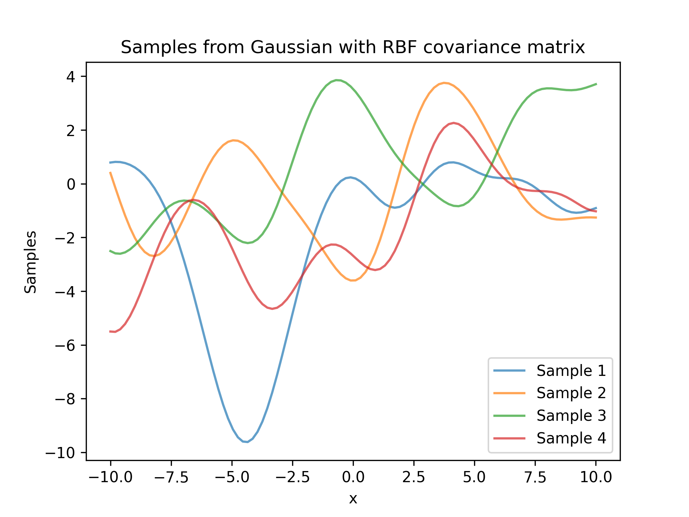
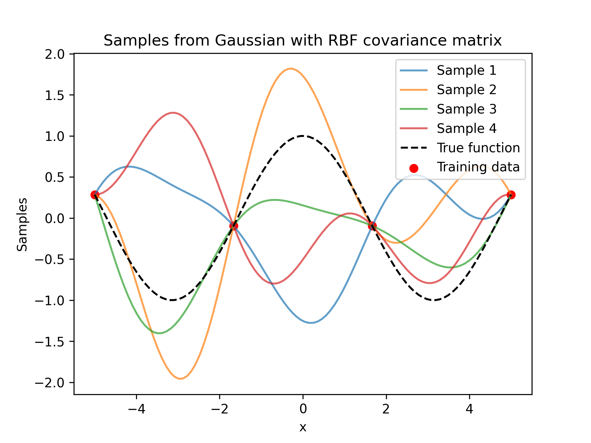
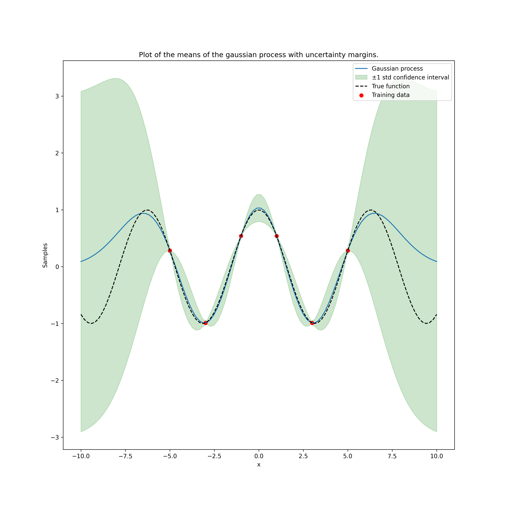
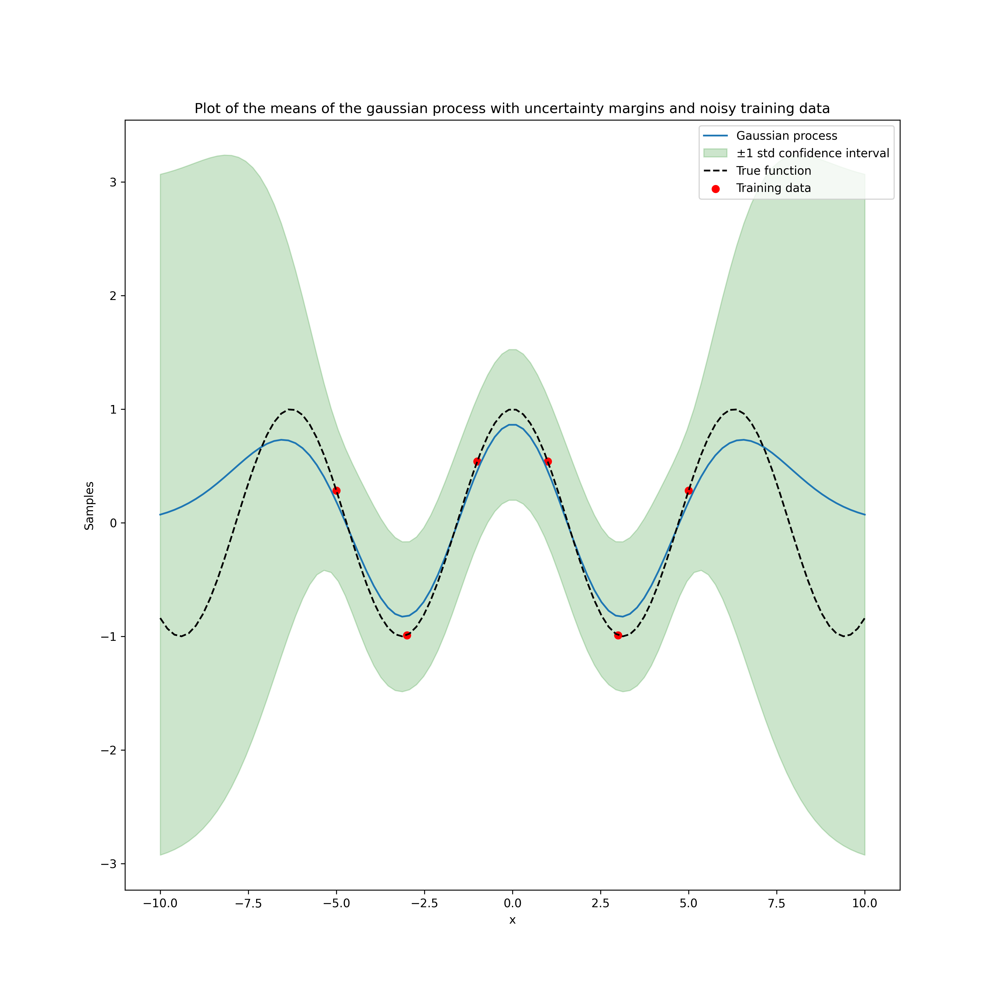

# Gaussian processes

A gaussian process is a method of approximating data using Bayesian statistics, given some data $X$ we want to be able to approximate the function that produced it, the idea of the gaussian process is that we can predict the shape of the underlying distribution.

The fact that it is bayesian means that as we add new datapoints the fitting to the function improves.

## Normal distribution

The normal (gaussian) distribution takes a mean $\mu$ and standard deviation $\sigma$, the one dimensional pdf of the function has the form:

$$p_X(x;\mu,\sigma) = \frac{1}{\sqrt{2\pi}\sigma}e^{-\frac{(x-\mu)^2}{2\sigma^2}}$$

If some data $X$ is distributed normally we say that $X$ ~ $N(\mu, \sigma^2)$. The below image shows a normal distribution with some interesting parts indicated.

 

In higher dimensions we can define gaussians too, in 3d it looks like a bell, and as the dimensions increase it becomes harder to visualise, A 2 dimensional gaussian can be defined by two quantities:

1. A vector of means, $\vec\mu$ which contains the mean for each dimension of the normal distribution
2. A covariance matrix $\Sigma$ where the diagonal elements $\Sigma_{ii}$ are the variances for each dimension and the off diagonal elements are $\Sigma_{ij}$ which define the correlation between the respective dimensions of data. The ij element of the covariance matrix is $\Sigma_{ij} = \mathbb{E}[(X-\mu_i)(Y-\mu_j)]$

The correlations between the variables define the shape of the normal distribution. See the plot below.

## Marginalisaiton and conditioning of the Gaussian

Suppose that we have a normal distribution over two random vectors $X$ and $Y$, $P(X,Y)$ then their joint distribution is defined as:

$$
P_{X,Y} \sim N(\vec\mu, \Sigma) = N(
    \begin{pmatrix}
    \mu_X \\
    \mu_Y
    \end{pmatrix},
    \begin{pmatrix}
    \Sigma_{XX} \ \Sigma_{XY} \\
    \Sigma_{YX} \ \Sigma_{YY}
    \end{pmatrix}
)
$$

**Where we're using block matrix notation here, so** $\Sigma_{XY} \in \mathbb{R}^{|X| \times |Y|}$.

These operations are defined as follows:

1. **Marginalisation**: We can find the marginalised distributions of $X$ and $Y$ as $X \sim N(\mu_X, \Sigma_{XX})$ and $Y \sim N(\mu_Y, \Sigma_{YY})$.
2. **Conditioning**: The probability of an event given some prior knowledge can be calculated as $X|Y \sim N(\mu_X + \Sigma_{XY}\Sigma_{XX}^{-1}(Y-\mu_Y), \Sigma_{XX} - \Sigma_{XY}\Sigma_{YY}^{-1}\Sigma_{YX})$

Gaussian distributions are closed under both of these operations, meaning that after we apply these operations the final distribution is still gaussian.

## Why use gaussians?

Suppose that we have some input training data $Y$, we can treat each element of this vector as a normally distributed variable. Let $X$ denote the testing data that will be used to assess the gaussian. The key idea of the gaussian process is to model the underlying distribution of $X$ together with $Y$ as a multivariate normal distribution.

### Covariance functions aka Kernels

When setting up a gaussian process (a type of stochastic process) we need to have an initial value for the mean and covariance matrix. Usually we can set the mean to be 0. We define the covariance using a covariance function, $k$, as this will define the behaviour of the function that is being fitted.

A common kernel function that is used is the RBF Kernel defined as follows:

$$
k(t,t') = \sigma^2e^{-\frac{|t-t'|^2}{2l^2}}
$$

So we can calculate the $i,j$ component of the covariance matrix $\Sigma_{ij} = k(x_i,x_j)$.

We can then take a vector of points $X$ with some dimensionality, $N$, and calculate the covariance matrix by looping over these points pairwise. This essentially allows us to shape the gaussian distribution with a certain kernel. We then take the output of the distribution we can treat each entry as a function value, see the figure below.

Given a set of values we can then generate random functions from these covariance matrices.

### Posterior distribution

Bringing this task back to regression, we need to find a way to fit a gaussian process to a function. We need to use the ideas from bayesian inference, we can use the training data to create a posterior distribution from a prior distribution aka $P_{X|Y}$.

First we need to form the joint distributions between the test points ($X$) and the training points ($Y$), $P_{X,Y}$. Then from this joint distribution we can use bayes' theorem to find the conditional distribution of the data aka the posterior distribution, so then $X|Y \sim N(\vec\mu',\Sigma')$. When we condition on the training points, $Y$, we are left with a gaussian with a dimension of $|X|$.

The conditional distribution here is defined with $X$ and $Y$ where we presume that the mean is $\vec\mu = \vec0$ and the covariance matrix $\Sigma$, of the joint distribution of $X,Y$, suppose that $|X| = N$ and $|Y| = M$ so the covariance matrix is $\Sigma \in \mathbb{R}^{M + N \times M + N}$.

$$
\Sigma = \begin{pmatrix}
    \sigma_{1,1} \ \dots \sigma_{1, N} \dots \ \sigma_{1, M + N} \\
    \vdots \\
    \sigma_{N, 1} \dots \ \sigma_{N,N} \ \dots\sigma_{N, M+N}\\
    \vdots \\
    \sigma_{M+N,1} \ \dots \ \sigma_{M+N,N} \dots \ \sigma_{M+N, M + N} \\
\end{pmatrix}
$$

Or alternatively, using the notation that $k(X,Y) \in \mathbb{R}^{|X| \times |Y|}$, we have that:

$$
\mathbb{\Sigma} = \begin{pmatrix}
    k(X,X) \ k(X,Y) \\
    k(Y,X) \ k(Y,Y)
\end{pmatrix}
$$

Our aim when approximating functions is given some training data $Y$ can we predict the function values for some tesing data $X$, in other words if we have the trianing pairs $(X_1,Y_1)$ and then the testing data $X_2$, we want to predict $Y_2$. Then we have that:

$$
Y_2|Y_1, X_1, X_2 \sim N(\Sigma_{X_2X_1}\Sigma_{X_1X_1}^{-1}Y_1, \Sigma_{X_2X_2} - \Sigma_{X_2X_1}\Sigma_{X_1X_1}^{-1}\Sigma_{X_1,X_2})
$$

Then samples taken from this are guaranteed to go through the points defined by $(X_1,Y_1)$, see the figure below:

We can also use the fact that the gaussian processes have uncertainty built into them to plot the mean value of the gaussian distribution and then the standard deviation around it. That looks like the following:

#### Accounting for uncertainty and noise in real data

In real data we see noise and uncertainty in our measurements, so we need to account for this in our funcitonal regression. In many cases when we have a set of functions that pass directly through our training points $Y$ that is unecessarily complex as we presume that the training points are perfect measurements. In the real world this assumption is most likely wrong, since most measurements contain some amount of error. To account for this we can define some error term, $\epsilon \sim N(0, \psi^2)$, then we can update our training points with this variable as follows:

$$
Y = f(X) + \epsilon
$$

Where $f(X)$ denotes the gaussian process. We can update the trianing data accordingly by adding the $\psi^2$ parameter to the covariance matrix of the joint distributoin of the testing and training data of the guassian process as follows:

$$
P_{X,Y} = \begin{pmatrix}
    X \\ Y 
\end{pmatrix}
\sim N(0, \Sigma) = N{
    \begin{pmatrix}
        k(X,X) \ \ \ \ \ \ \ \ \ \ \ \  \ k(X,Y) \\
        k(Y,X) \ \ \ \ k(Y,Y) + \psi^2I
    \end{pmatrix}
}
$$

Now applying this rule to some data with $\psi = 1$ and with the function we're trying to approximate being $f(x) = \cos(x)$, we have the following figure:

Notice how the uncertainty bounds are larger around the training points, translating the fact that there's uncertainty even in the known measurements.

### Gaussian optimisation

Baysean optimisation is a probabalistic method of optimising functions, we require something called a _surrogate model_ of a true function $f$ which we define as $f$'s **prior** distribution. We then have a set of observations (which we've been calling $Y$) that we can use with Bayes rule to obtain the **posterior** distribution. Then we can use something called an _aquisition function_ $\alpha(x)$, which is a function of the posterior, to decide the next point to sample, i.e. $x_t = \argmax_x \alpha(x)$. Once we've found a new $x_t$ we can evaluate our function $f(x_t)$ and add it to $Y$ and repeat the calculation of the posterior distribution. From this point we repeat this process until the observations converge, or the iteration limit is expended.

Note that this optimisation is meant to be used for expensive functions, such as neural networks that require a lot of compute to run, therefore the optimisation points need to  be chosen strategically.

#### Acquisition functions

It's all well and good defining what an acquisition function is, but what on Earth could this be? How can we sample points in an inteligent way using it?

##### Probability of Improvement

This acquisition function chooses the next query point as the one with the highest probability of improvement over the current maximum (according to the posterior distribution).  This looks like:

$$
x_{t+1} = \argmax_x(\alpha_{PI}(x)) = \argmax_x(\mathbb{P}(f(x) \geq f(x^+) + \epsilon))
$$

Where $x^+ = \argmax_{x \in X_1}f(x)$, $\epsilon$ is a small positive number.

We canr reframe this probability as just looking at the upper tail of the surrogate posterior, we can manipulate as follows:

$$
\mathbb{P}(f(x) \geq f(x^+) + \epsilon) = \mathbb{P}(f(x) - f(x^+) - \epsilon \geq 0) = \Phi{\begin{pmatrix}
    \frac{\mu_t(x) - f(x^+) - \epsilon}{\sigma_t(x)}
\end{pmatrix}
}
$$

Where $\Phi$ is the CDF of the surrogate (if it's a gaussian process) of the posterior, and the interior just centers the distribution around zero. $\mu_t(x)$ is the mean of the gaussian process at step $t$ and point $x$, and $\sigma_t(x)$ is the standard deviation of the process at step $t$ and point $x$. So our optimisation becomes:

$$
x_{t+1} = \argmax_x\Phi{\begin{pmatrix}
    \frac{\mu_t(x) - f(x^+) - \epsilon}{\sigma_t(x)}
\end{pmatrix}}
$$

We use $\epsilon$ to balance between exploration and exploitation, increasing $\epsilon$ results in querying locations with a larger $\sigma$ since we're looking for larger potential increases.

##### Expected improvement

The probability of improvement looked at the likeliood of improvement, but we didn't look at the realisation of that improvement. It may be more adventageous to look at the expected improvement rather than the probability. Now our acquisition function takes the form of:

$$
x_{t+1} = \argmin_x{\mathbb{E}(|\mu_{t}(x) - f(x^{\star})| \ | D_t)}
$$

Where $f$ is the surrogate function, $\mu_{t+1}(x)$ is the posterior mean of hte surrogate model evaluated at point $x$, $D_t$ is the training data thus far, and $x^{\star}$ is the actual position where $f$ takes it's maximum value. We can represent this equivalently with the assumption that we don't know the closed form of the function f:

$$
x_{t+1} = \argmin_x{\mathbb{E}(\max{(0, \mu_t(x) - f(x^+))} \ | D_t)}
$$

Then for a gaussian process we can express the expected improvement as shown below:

$$
EI(x) = \begin{cases}
    (\mu_t(x) - f(x^+) - \epsilon)\Phi(Z) + \sigma_t(x)\phi(Z), \text{if} \  \sigma_t(x) > 0 \\ 
    0, \text{if} \ \sigma_t(x) = 0
\end{cases}
\\
Z = \frac{\mu_t(x) - f(x^+) - \epsilon}{\sigma_t(x)}
$$

Where $\Phi$ is the gaussian CDF and $\phi$ is the gaussian PDF.

### Multi dimensional gaussians [WIP]

We've seen how to use gaussians in one dimension, now how can we generalise this notion to multiple dimesions. This is useful as most prediciton tasks will require multiple outputs from a gaussian process such as temperature, pressure or wind speed - or alternatively in machine learning, we may be wanting to find the ideal learning rate and temperature for our transformer. This will come in very handy when we look into optimisation using gaussian processes later on in this research doc.

